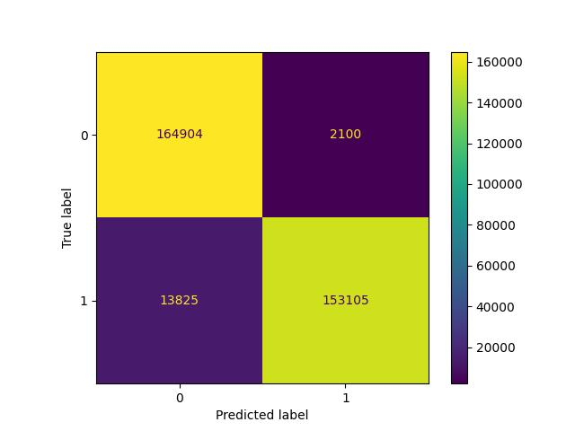
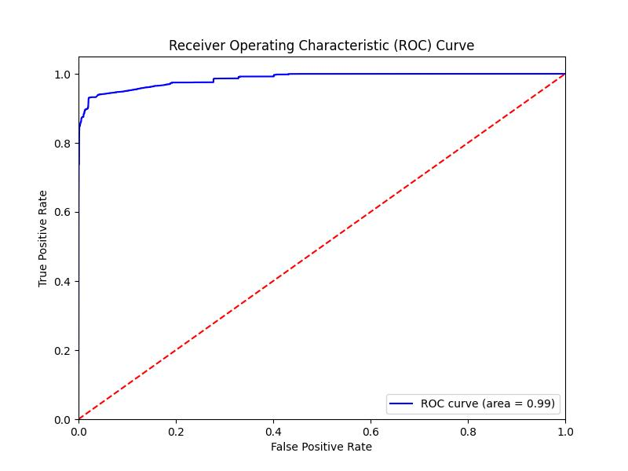
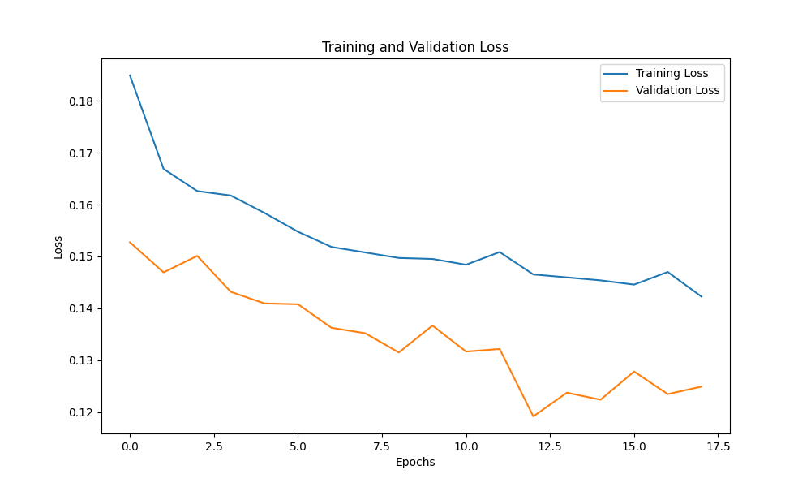
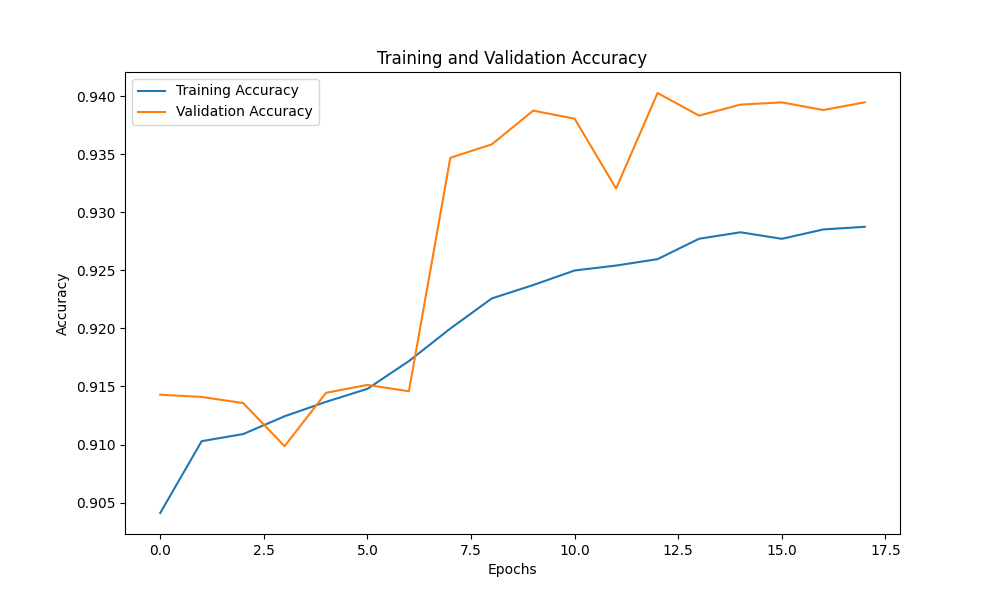

# Network Anomaly Detection using Neural Networks

## Project Overview

In today's digital age, network security is paramount. With the increasing volume and sophistication of cyber-attacks, there is a pressing need for robust anomaly detection systems to safeguard network integrity. This project aims to enhance network security by identifying and classifying anomalous network traffic using advanced neural network techniques.

## Dataset

The dataset used in this project is the CICIDS 2017 dataset, which contains labeled network traffic data for various types of attacks and normal traffic. The dataset was preprocessed to remove missing values, normalize features, and encode labels.

### Preprocessing Steps
1. **Data Preprocessing:**
   - Combined initial CSV files into one (2.8 million records).
   - Removed missing values.
   - Performed normalization.

2. **Label Encoding:**
   - Encoded categorical labels.
   - 0 = Anomalous, 1 = Benign.

3. **Feature Selection:**
   - Used Random Forest for feature importance.
   - Selected top 20 features out of 78 total.

4. **Model Training:**
   - Split dataset into train and test sets.
   - Built and trained a neural network model.
   - Applied early stopping to prevent overfitting.

## Methodology

### Neural Network Architecture
The neural network model consists of three layers:
1. **Input Layer:** Takes the top 20 selected features.
2. **Hidden Layers:** Two hidden layers with ReLU activation and Dropout for regularization.
   - Dense layer with 64 units and ReLU activation.
   - Dropout layer with 0.5 rate.
   - Dense layer with 32 units and ReLU activation.
   - Dropout layer with 0.5 rate.
3. **Output Layer:** Sigmoid activation to output a probability score for the binary classification.

### Model Training
- **Optimizer:** Adam
- **Loss Function:** Binary Crossentropy
- **Metrics:** Accuracy
- **Early Stopping:** Monitored validation loss with patience of 5 epochs.

### Model Evaluation
The model was evaluated using various metrics:
- **Confusion Matrix:** Visualized the true vs. predicted labels.
- **ROC Curve:** Analyzed the model's diagnostic ability.
- **Training Curves:** Plotted training and validation loss and accuracy over epochs.

## Results

### Confusion Matrix
The confusion matrix illustrates the number of correct and incorrect predictions made by the model.
- **True Positives:** Correctly identified benign traffic.
- **True Negatives:** Correctly identified anomalous traffic.
- **False Positives:** Benign traffic incorrectly classified as anomalous.
- **False Negatives:** Anomalous traffic incorrectly classified as benign.



### ROC Curve
The ROC curve demonstrates the trade-off between the true positive rate and false positive rate at various threshold settings. The AUC value of 0.99 indicates excellent model performance.



### Training and Validation Loss
The training and validation loss curves show the model's loss over epochs, indicating how well the model is learning over time.



### Training and Validation Accuracy
The training and validation accuracy curves show the model's accuracy over epochs, indicating how well the model's predictions align with the true labels.



## Usage

### Prerequisites
- Python 3.x
- Required Python packages listed in `requirements.txt`

### Installation
1. Clone the repository:
   ```bash
   git clone https://github.com/yourusername/network-anomaly-detection.git
   cd network-anomaly-detection
